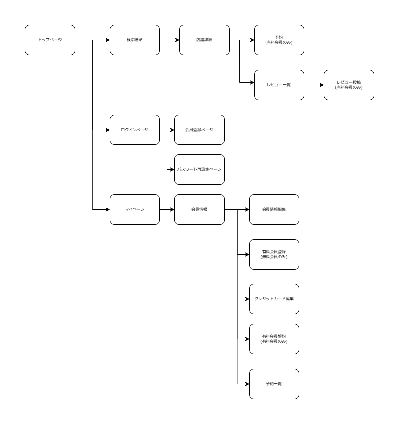
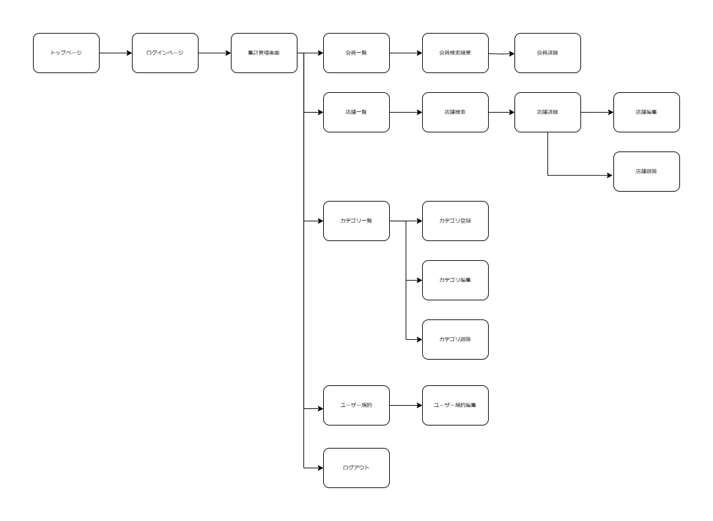
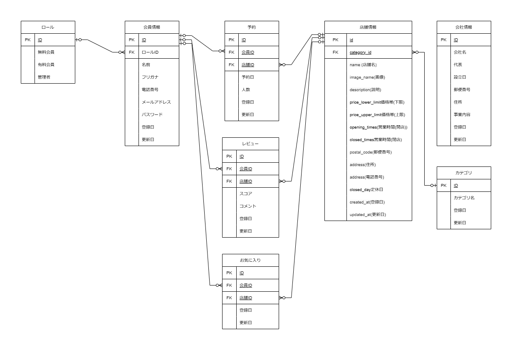
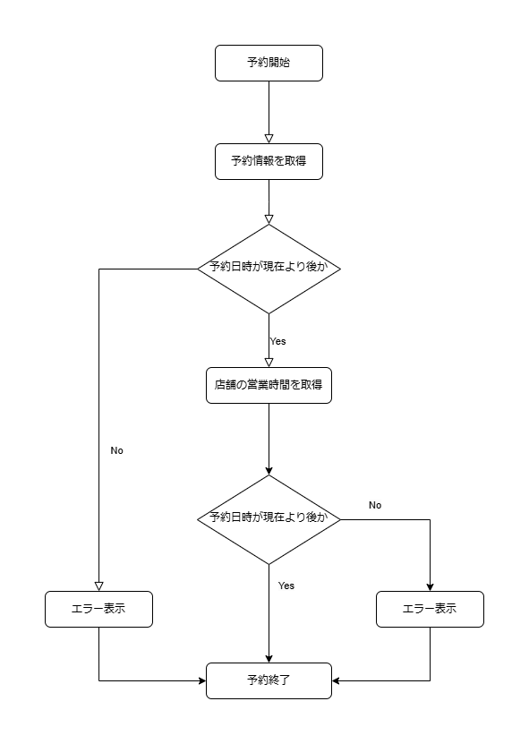

# NAGOYAMESHI 要件定義書
## 実装機能（要件定義）
### 【会員側実装機能】

* 店舗情報
  * 店舗名による店舗の検索機能
  * カテゴリによる店舗の絞り込み機能
  * 評価、登録日による並び替え機能
  * 店舗詳細ページにおけるレビューの表示機能
* 会員登録
  * メール認証機能
  * メールアドレスとパスワードによるログイン機能
* 会員情報
  * 会員情報の編集
  * 有料会員へのアップグレード機能
  * 退会機能
* 有料会員(月額300円)
  * サブスク契約機能
  * サブスク契約の解除機能
  * クレジットカード情報の編集機能
  * お気に入りの追加機能
  * 店舗詳細ページにおけるレビューの投稿機能
  * 店舗の予約機能
    * 予約完了メールの送信機能
    * 現在の予約の確認機能
    * 過去の予約の確認機能
    * 予約のキャンセル機能

### 【店側実装機能】
* 認証機能
  * メールアドレスとパスワードによるログイン機能
* 基本情報の設定
  * 利用規約の編集機能
* 店舗管理
  * 店舗の一覧表示機能
  * 店舗名による店舗検索機能
  * 店舗の詳細を表示する
  * 店舗の登録・編集・削除機能
  * レビューの一覧表示機能
  * レビューの削除機能
* 会員管理
  * 会員の一覧表示機能
  * 会員の詳細ページ機能
  * フリガナによる会員の検索機能
* 集計機能
  * 総会員数
  * 無料会員数
  * 有料会員数
  * 店舗数
  * 月間売上

## 機能設計

### 会員

1. トップページ
   - 検索ボックス、カテゴリボタン、新規店舗記載、会員が店舗を見つけやすくする機能を表示する
2. 検索機能
    - 店舗検索するためのボックス設置
3. 絞り込み機能
    - カテゴリを絞り込むためのセレクトボックス
4. 並び替え機能
    -  評価や登録日などで並び替えるためのセレクトボックス
5. レビュー表示機能
    - 会員によるレビューの表示
6. 店舗一覧ページ
    - 検索結果、絞り込みに応じた結果を表示
7. 店舗詳細ページ
    - 店舗画像や店舗の基本情報、予約のボタンを表示
8. ユーザー登録機能
    - メールアドレス、パスワード、氏名、住所などの情報を記入しアアカウントを作成する機能
9. メール認証機能
    - 会員登録に入力されたメールアドレス宛にメールを送信し認証を行う。
10. ログイン機能
    - 登録したメールアドレスとパスワードを入力してアプリにログインする機能
11. ログアウト機能
    - アプリからログアウトする機能
12. パスワードリセット
    - パスワードを再設定できるようにする機能
13. 会員情報の確認機能
    - 登録した会員情報を登録する機能
14. 会員情報の編集機能
    - 登録した会員情報の編集をする機能
15. 有料会員へのアップグレード
    - クレジットカード情報を登録することで、有料会員へアップグレードできるようにする
16. 有料会員を退会
    - 有料会員をやめる
17. 退会機能
    - 退会することができる機能
18. クレジットカードの登録
    - 外部サービスを利用して月額300円での契約を結ぶことができる
19. クレジットカード情報の削除
    - 契約を解除
20. クレジットカードの編集
    - クレジットカードの情報を編集することができる
21. お気に入り登録機能
    - 店舗の詳細ページでお気に入りすることができ、お気に入りした店舗の情報の一覧を表示できる
22. お気に入り削除機能
    - 店舗をお気に入りしていたものを削除できる機能
23. レビューの登録、編集
    - 店舗の詳細ページでレビューを作成できる。また、編集でもできるようにする
24. 店舗予約機能
    - 店舗の詳細ページでカレンダーを使って予約できるようにする
25. 予約のキャンセル機能
    - 予約日時を過ぎていなければ予約をキャンセルできるようにする

### 管理者

1. ログイン機能
   - メールアドレスとパスワードによるログイン機能
2. ログアウト機能
   - ログアウトする機能
3. 利用規約の編集機能
   - 利用規約の内容を編集できるようにする。
4. 店舗の一覧表示機能
   - 登録されている店舗を表示する
5. 店舗名による店舗検索機能
   - 店舗名から当てはまるものを検索し表示する
6. 店舗の詳細を表示する
   - 店舗の詳細を表示させる
7. 店舗の登録・編集・削除機能
   - 店舗の登録・編集・削除をできるようにする
8. レビューの一覧表示機能
   - 店舗の詳細ページからレビューを表示させる
9. レビューの削除機能
   - レビュー一覧で、レビューを削除することができる
10. 会員の一覧表示機能
    - 会員全員の一覧の表示をする
11. 会員の詳細ページ機能
    - 会員一覧から個人の会員の詳細を表示する
12. フリガナによる会員の検索機能
    - フリガナから対象の会員の検索をできるようにする
13. カテゴリ一覧ページ
    - カテゴリの一覧を表示する
14. 検索機能
    - カテゴリの検索ができる
15. カテゴリ登録ページ
    - カテゴリの入力フォームを表示する
16. カテゴリ登録機能
    - カテゴリを登録できる
17. カテゴリ編集ページ
    - カテゴリの編集用の入力フォームを表示する
18. カテゴリ編集機能
    - カテゴリを編集する
19. カテゴリ削除機能
    - カテゴリを削除する

## 画面遷移図

管理者用

## ER図

## フローチャート

 
